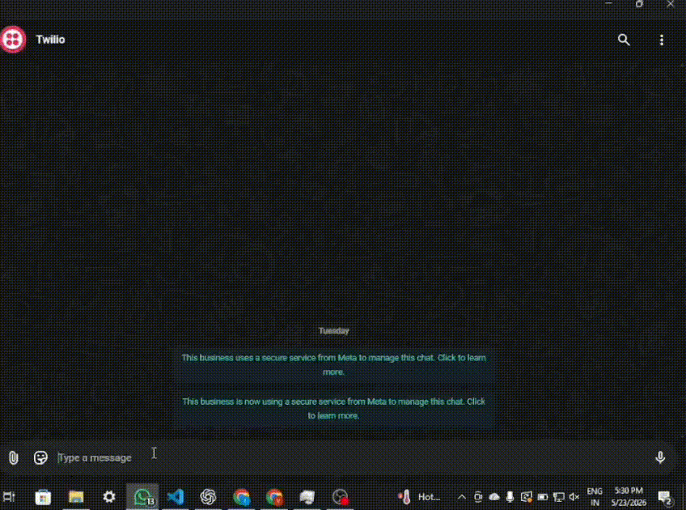
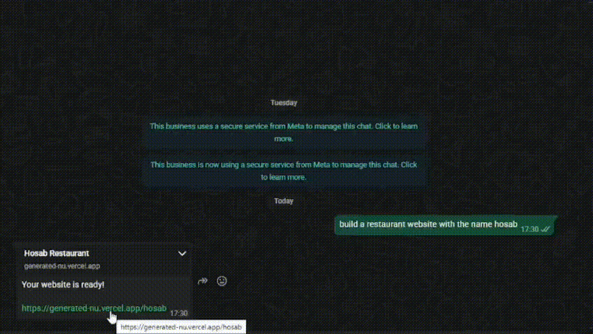

# AI Website Generator via WhatsApp

An AI-powered website generator that creates and deploys fully responsive websites directly from WhatsApp messages using Flask, Groq LLM, Tailwind CSS, Twilio WhatsApp API, and Vercel.

---

# Features

* Generate websites from natural language prompts
* WhatsApp-based interaction
* AI-powered website planning and generation
* Modern responsive UI using Tailwind CSS
* Functional JavaScript components
* Automatic Vercel deployment
* Unique URLs for every generated website
* Dynamic website type detection
* Multi-page scalable architecture

---

# Tech Stack

## Backend

* Python
* Flask

## AI

* Groq API
* Llama 3.3 70B

## Frontend Generation

* HTML
* Tailwind CSS
* JavaScript

## Messaging

* Twilio WhatsApp Sandbox

## Deployment

* Vercel

## Tunneling

* ngrok

---

# Project Architecture

```text
User WhatsApp Message
        ↓
Flask Webhook
        ↓
AI Planner (JSON Structure)
        ↓
AI Website Generator
        ↓
Save Website
        ↓
Deploy to Vercel
        ↓
Send URL Back to WhatsApp
```

---

# Folder Structure

```text
website-generator/
│
├── ai/
│   ├── planner.py
│   └── website_generator.py
│
├── deployment/
│   └── vercel_deployer.py
│
├── generated/
│   ├── website-1/
│   ├── website-2/
│   └── ...
│
├── utils/
│   └── builder.py
│
├── main.py
├── requirements.txt
├── .env
└── .gitignore
```

---

# Environment Variables

Create a `.env` file:

```env
GROQ_API_KEY=your_groq_api_key
VERCEL_TOKEN=your_vercel_token
```

---

# Installation

## Clone Repository

```bash
git clone https://github.com/yourusername/website-generator.git

cd website-generator
```

---

## Create Virtual Environment

```bash
python -m venv .venv
```

Activate environment:

### Windows

```bash
.venv\Scripts\activate
```

### Linux/Mac

```bash
source .venv/bin/activate
```

---

## Install Dependencies

```bash
pip install -r requirements.txt
```

---

# Run Flask Server

```bash
python main.py
```

---

# Start ngrok

```bash
ngrok http 5000
```

Copy generated HTTPS URL.

---

# Configure Twilio Webhook

Paste ngrok webhook URL:

```text
https://your-ngrok-url/webhook
```

inside Twilio WhatsApp Sandbox webhook settings.

---

# Join Twilio Sandbox

Send sandbox join code to:

```text
+1 415 523 8886
```

Example:

```text
join abc-xyz
```

---

# Example Prompt

```text
Build a luxury restaurant website named Chingons
```

or

```text
Create an AIML portfolio website for the name Raviteja

---

# Example Output




---

# Core Functionalities

* AI website planning
* AI HTML generation
* Automatic deployment
* Dynamic routing
* Functional forms/buttons
* Responsive layouts
* Dark modern UI
* Unique website hosting

---

# Future Improvements

* Database integration
* User authentication
* Persistent website editing
* Drag-and-drop editing
* Image generation support
* Multi-page websites
* Domain customization
* Website analytics
* Payment integration

---

# Author

Raviteja Cherupally
